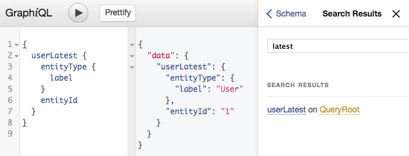

# Exposing new queries

Adding new queries to the schema is the simplest way to extend the GraphQL, as
it only uses existing types and only defines new queries and the fields they 
expose. We shall create a new module for this, called `graphql_example_query`, 
which defines a way to obtain the latest user created on the site (from
`Drupal\user\Entity\User->uid`):

* create the module directory and `graphql_example_query.info.yml`, adding a
  dependency on `graphql`.
* since queries add fields to the schema, add a new field class to the module
* add a schema provider to the module, referencing the new field

## Adding a field class

* Field are simple classes (not services), extending the 
`Drupal\graphql\GraphQL\Field\FieldBase` base field class.
* They are instantiated from a configuration including:
  * a `name` to identify them
  * a `type` to describe their GraphQL type, 
  * arguments, which GraphQL calls `args`, known by their own name and type.
* They should be organized in namespaces, with fields available on the root
query being in a `\Drupal\[module]\GraphQL\Field\Root` namespace - as in the 
simple example below - or one of its sub-namespaces if the module defines 
multiple types of schema extensions.

[AST]: https://en.wikipedia.org/wiki/Abstract_syntax_tree
 

```php
  // in src/GraphQL/Field/Root/LatestUserField.php
  // ...
  use Youshido\GraphQL\Type\TypeInterface;
  use Youshido\GraphQL\Execution\ResolveInfo;
  // ...
  public function __construct(TypeInterface $type) {
    $config = [
      // The name by which users of GraphQL will know the field
      'name' => 'userLatest',
      // The field type definition used by GraphQL to describe it. 
      'type' => $type,
      // An array of arguments for the field.
      'args' => [],
    ];
    parent::__construct($config);
  }  
```
* When invoked in a query, the field instance will need to `resolve` the actual
  values it needs to return, based on:
  * a current `value`
  * the values of any `args` declared as available for the query
  * a `ResolveInfo` object containing 
    * the field instance itself
    * the parsed part of the query relating to the field, as an [AST] list
    * an execution context, containing - among other things - the whole schema 
      and the request itself
  
```php  
  // ... see "use" clause in previous fragment.
  public function resolve($value, array $args = [], ResolveInfo $info) {
    $entityTypeManager = $this->container->get('entity_type.manager');
    $entityStorage = $entityTypeManager->getStorage('user');
    $query = $this->container->get('entity.query');
    $uids = $query->getAggregate('user')
      ->aggregate('uid', 'MAX')
      ->execute();
    $uid = reset($uids);
    return $entityStorage->load($uid['uid_max']);
  }
```

## Adding a schema provider class

Once the field is defined, it can be exposed as part of the schema by a 
`SchemaProvider`. These are [collected services] bearing the 
`graphql_schema_provider` tag, like:

```yaml
# in graphql_example_query.services.yml
services:
  graphql_example_query.schema_provider:
    class: 'Drupal\graphql_example_query\SchemaProvider\LatestUserSchemaProvider'
    arguments:
      - '@typed_data_manager'
      - '@graphql.type_resolver'
    tags:
        - name: 'graphql_schema_provider'
```    

Schema providers are likely to need at least the Typed Data Manager and the 
GraphQL Type Resolver services as arguments, to provide type information to the
fields they expose.

[collected services]: https://api.drupal.org/api/drupal/core%21core.api.php/group/service_tag/8.3.x

They will normally extend `Drupal\graphql\SchemaProvider\SchemaProviderBase` in
order to take advantage of default definitions for the 
[`SchemaProviderInterface`] methods. Since this example defines a new query, the
method to implement is `getQuerySchema()`, which returns an instance of the new
Field objects introduced by the provider:

[`SchemaProviderInterface`]: https://github.com/fubhy/graphql-drupal/blob/8.x-3.x/src/SchemaProvider/SchemaProviderInterface.php

```php
  // in src/SchemaProvider/LatestUserSchemaProvider.php
  // ...
  use Drupal\graphql_example_query\GraphQL\Field\Root\LatestUserField;
  // ...
  public function getQuerySchema() {
    $dataDefinition = $this->typedDataManager->createDataDefinition('entity:user');
    $outputType = $this->typeResolver->resolveRecursive($dataDefinition);
    $fields = [
      new LatestUserField($outputType),
    ];
    return $fields;
  }
```

## Using the new query


